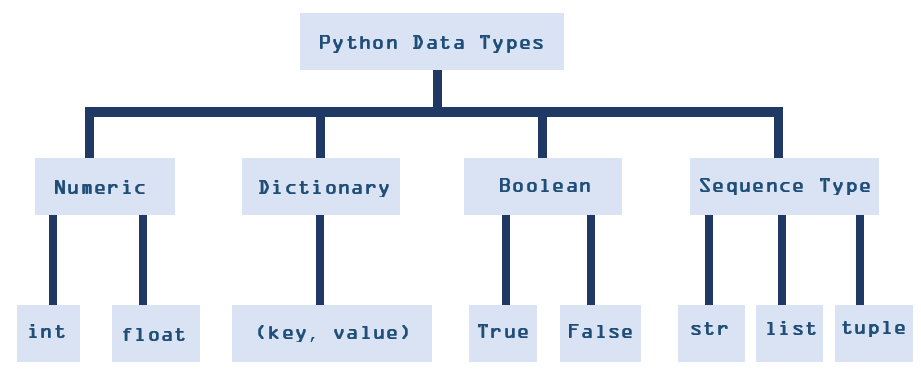

 
 

    
    <h1 align="center">📝 Data Structures and Algorithms Notes with Python</h1>
    
By Eliana Lopez

This repository contains a deep dive on Data Structures and Algorithms theory and concepts along with Python based examples of many popular algorithms and data structures.

<!-- TABLE OF CONTENTS -->
## Table of Contents  
<!-- AUTO-GENERATED-CONTENT:START (TOC:collapse=true&collapseText="Click to expand") -->

click to expand

 
- [Introduction and the Basics](#Introduction-and-the-Basics)  
- [Time & Space Complexity](#Time--Space-Complexity)

<!-- AUTO-GENERATED-CONTENT:END -->

## Introduction and the Basics
For this introduction I am going to define key terms so we can do into more depth about the applications and uses of data structures and algorithms.
These will be the key terms defined in this section:
* Data Types
* Abstract Data Types
* Algorithm
* Data Structure

### Data Types
Data types are important because they illustrate the kind of value in the variable and tells us what operations can be performed on any particular data. Down below is an intuitive definition  of what a data type is:

* An attribute of data that informs the interper on how to classify the variable. 

In Python there are four categories of data types: *numeric, squential, booleans, and dictonary* 
I have created a diagram of these categories of data types along with their respective data types down below.

### What is an Abstract Data Types (ADT)

For me, I like to think of an abstract data type as a thought process of the rules and operations of data, there is no concrete implementation, but just thoughts and ideas on how this process might work.

* A logical process on how we view data and allowed operations without the regard on how it will be implemented.

Note: An ADT is the *what it does.*

### What is an Algorithm
Overall this is the most intuitive definition  of an algorithm:

* A set of instructions used to solved a problem
 
Outside of computing, one example of an algorithm can be a recipe from a cookbook to craft a meal. Where we follow a certain set of instruction from the cook book to create our meal, which would thus solve the problem of our hunger. 

### What is a Data Structure

The *implementation of an abstract data type* can be refered to a data sturcture but intuitivly is a way of organizing data so it can be used effectively.

* A data structure is a format for accessing, storing, organizing, or structuring data.

Overall it is a technique of how data can inter-relate to each other logically or mathematically, or in layman's terms *how it does it.*

**The Connection between Data Structures and Abstract Data Types:**

**ADT gives us the blue print while a data structure tells us how to implement it**

### The Interconnection between Data Structures and Algorithms
To put it simply, data structures need algorithms and algorithms need data structures.

**The connection between algorithms and data structures is that an algorithm processes data and that data is then stored into a data structure.**

This is an illustration of the interconnection of a data structure and an algorithm:

## Time & Space Complexity 

Often, there is more than one way to solve the same problem with different programs. So how would you be able to compare the performance of different algorithms, *is one program better than the other?*

Well the answer to that question is quite simple, you have to see *which program is more efficient*. 

There are two ways to determine which algorithm is more efficient:
* The amount of space or memory an algorithm requires
* The amount of time an algorithm requires to execute

Overall time and space complexity can be impacted from several factors such as hardware, operating system.
### Time Complexity
#### Big-O

### Space Complexity

When determing space complexity, you have to ask, *how does the space usage of our algorithm change as input becomes larger?* An alternative question you can ask is, *How much memory, in a worse case senario, is needed?*

* Space complexity includes both *auxiliary space* (temporary space) and used space

Similar to time complexity, space complexity can also be expressed using Big-O notation.

*What space does your program create?*
* *does it create a singal array of n-elements?*
* *does it create log(n) elements?*
* *ect...*

*Note: Runtime stack is a part of space complexity* 
